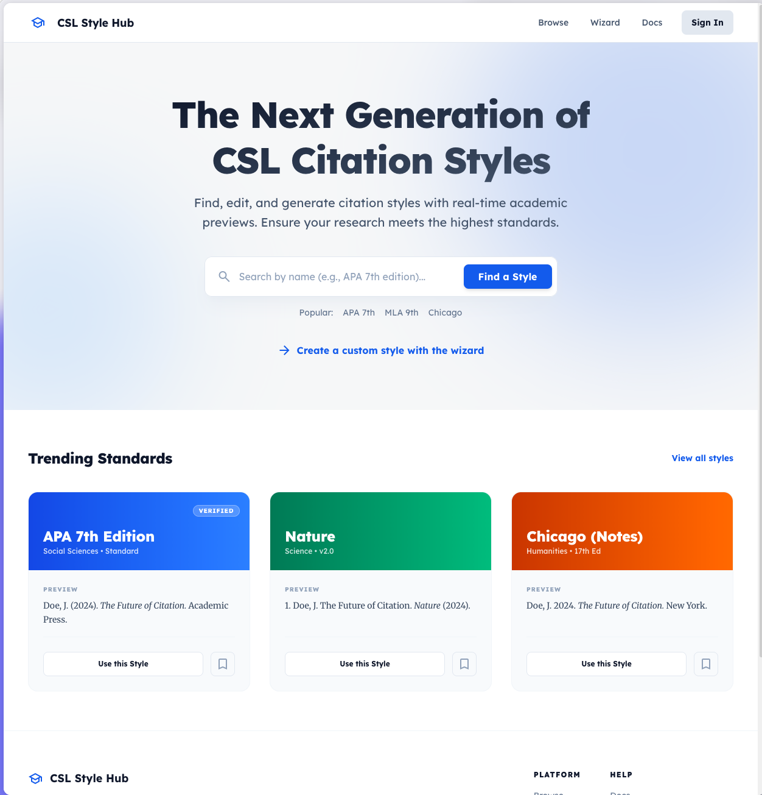

# CSLN Style Hub

A modern repository to quickly find, edit, and create CSLN Citation Styles. Developed in lockstep with that broader ecosystem!



## Project Structure

- `server/`: Rust backend using Axum and a custom intent-based decision engine.
- `client/`: SvelteKit 5 frontend with Tailwind CSS 4.

## Features

- **Style Discovery**: Find and browse existing citation styles from the CSL repository.
- **Intent-Based Wizard**: Create new styles by answering simple questions about how you want your citations to look, rather than editing XML directly.
- **Personal Library**: Create an account to save and manage your custom styles.
- **Persistence**: Securely store your styles in a database, allowing you to return and edit them later.
- **GitHub Integration**: Sign in with your GitHub account for a seamless experience.
- **Live Preview**: Real-time rendering of citations and bibliographies as you make decisions.
- **CSL Export**: Download your finished style as a valid CSL XML file.

## Design Philosophy

The editor prioritizes **Visual Discovery**. Most users are looking to tweak an existing style. The Landing Page focuses on search and trending styles, with the **Creation Wizard** serving as a "Start from Scratch" option for advanced needs.

The interface uses a clean, premium "Paper" aesthetic for previews, providing an academic context for the design decisions.

## Technology Stack

- **Backend**: Rust, Axum, SQLx, Postgres, OAuth2.
- **Frontend**: Svelte 5, SvelteKit, Tailwind CSS 4, Lucide Svelte.
- **Database**: PostgreSQL for persistent storage.
- **Authentication**: GitHub OAuth for user management.

## Setup & Development

### Prerequisites

- [Docker](https://www.docker.com/) (for running the database)
- [Rust](https://www.rust-lang.org/)
- [Node.js](https://nodejs.org/) or [Bun](https://bun.sh/) (preferred by some developers)

### Environment Configuration

1. Copy the example environment file in the server directory:
   ```bash
   cp server/.env.example server/.env
   ```
2. Fill in the required values in `server/.env`, including your GitHub OAuth credentials.

### Running the Project

1. **Start the Database**:
   ```bash
   docker-compose up -d
   ```

2. **Run Migrations** (optional, the server runs them on startup):
   ```bash
   cd server
   cargo sqlx migrate run
   ```

3. **Start the Application**:
   From the root directory:
   ```bash
   npm run dev
   # OR if you prefer Bun
   bun run dev
   ```

   This will start both the backend server (at `http://localhost:3000`) and the frontend client (at `http://localhost:5173`) concurrently. The scripts are configured to automatically prefer Bun if it is installed, or use Node.js otherwise. You can override this by setting the `PM` environment variable (e.g., `PM=npm npm run dev`).
